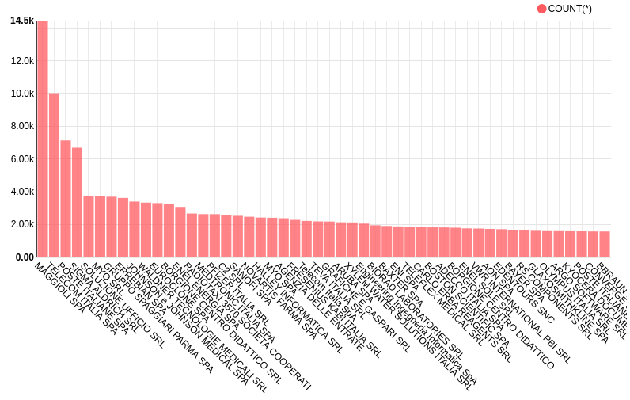
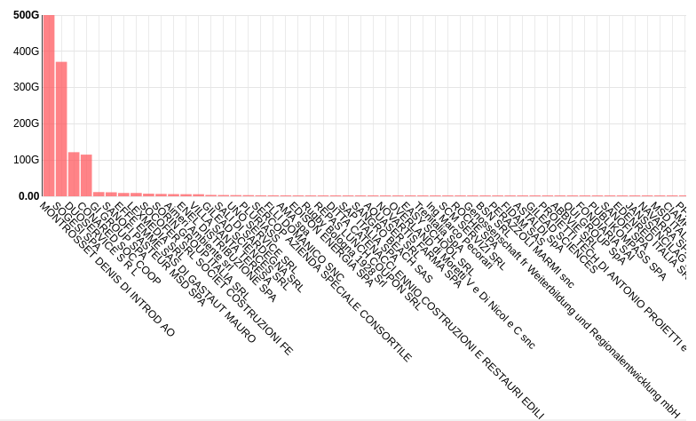
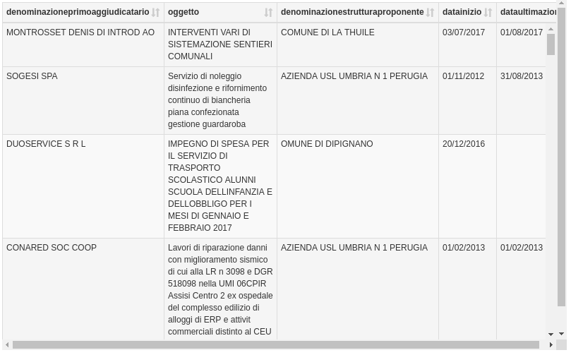
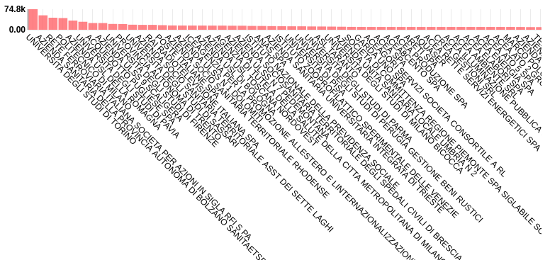

# L'Anticorruzione nella Pubblica Amministrazione
##Usare i dati per tutelare la legalità

<h2><b>Introduzione</b></h2>
L'<b></b><a href="http://www.anticorruzione.it/portal/public/classic/"><b>Autorità Nazionale Anticorruzione</b> </a>(<b>ANAC</b>) è l'istituto di garanzia che si occupa di portare avanti della attività di <b>vigilanza dei contratti pubblici</b> e degli incarichi nella pubblica amministrazione. L'obiettivo istituzionale è la prevenzione della <b>corruzione</b> nell'ambito delle amministrazioni pubbliche e nelle società partecipate e controllate, mediante l'introduzione di procedure che prevedano l'attuazione della trasparenza in tutti gli aspetti burocratici, dalla revisione dei procedimenti alla pubblicazione della documentazione in formato aperto. In questo modo la gestione del processo risulta più integrata e si facilita l'instaurazione di un rapporto di collaborazione fra le <i>Pubbliche Amministrazioni</i>, organi di controllo (ad esempio la <i>Corte dei Conti</i>) e comuni cittadini.&nbsp; 

In questa analisi mostreremo come le moderne tecniche di<i> Data Analysis</i> e di <i>Natural Language Processing</i> possono essere messe in pratica per gestire i processi di controllo e di revisione quando la quantità di dati e la densità di informazioni è così elevata.

Dopo aver inserito il dataset nel <a href="https://dataportal.daf.teamdigitale.it/" style="background-color: rgb(255, 255, 255);">dataportal</a>&nbsp;svolgeremo qualche analisi esplorativa che commentiamo in questo post e visualizziamo con dei grafici tramite l'utilizzo di widget&nbsp;<a href="https://bi.daf.teamdigitale.it/superset/welcome">SuperSet</a>.&nbsp; Successivamente integriamo i dati con quelli provenienti da altri portali e sfruttiamo il linguaggio di programmazione <i>Python </i>per l'analisi approfondita, che sarà invece integrata sottoforma di <a href="https://daf-dataportal.readthedocs.io/it/latest/datascience/jupyter/">Notebook</a>&nbsp;con dei link. Infine viene utilizzato un algoritmo di&nbsp;<i>Machine Learning</i> al fine di produrre un grafo che unisce gli oggetti simili, un classificatore che riesca a farci districare in questa "giungla" di dati.
<h2><b>Il ruolo dei dati</b></h2>
Al fine di rendere operativa ed efficiente l'attività di contrasto alla corruzione è necessario mettere in campo delle infrastrutture informatiche adeguate, ossia <b>piattaforme</b> capaci di gestire ed elaborare grandi moli di dati.&nbsp;

<i>L'ANAC</i> mette a disposizione in formato aperto i dati in materia di anticorruzione, trasparenza e contratti pubblici acquisiti. I dati sono organizzati in <b>dataset</b> visualizzabili interattivamente in anteprima sotto forma di tabella e sono scaricabili in formato aperto e standardizzato: <i>JSON,</i>&nbsp;<i>CSV</i>&nbsp;o&nbsp;<i>XML.</i>

Questi dati, dopo essere stati inseriti e categorizzati, vengono aggiunti al <i>Catalogo dei dati</i> e vengono resi disponibili sotto forma di <b class="">OpenData</b>, reperibile al sito <a href="https://dati.anticorruzione.it/">https://dati.anticorruzione.it/</a>.

Esplorando il <i>Catalogo</i>, vediamo che ci sono diversi elenchi:

&nbsp; &nbsp; - <i style="">RPC</i>: elenco dei Responsabili per la Prevenzione della Corruzione &nbsp; &nbsp; - <i style="">RT</i>: elenco dei Responsabili per la Trasparenza &nbsp; &nbsp; -<i> <b>L.190/2012</b></i>: comunicazioni pervenute ed elaborate in adempimento alla Legge 190 del 2012, articolo 1, comma 32.

La <i>Legge n.190</i> definisce le modalità di classificazione e di gestione dei contratti pubblici: 

<i>[...] le stazioni appaltanti sono in ogni caso tenute a pubblicare nei propri siti web istituzionali: la struttura proponente; l’oggetto del bando; l’elenco degli operatori invitati a presentare offerte; l’aggiudicatario; l’importo di aggiudicazione; i tempi di completamento dell’opera, servizio o fornitura; l’importo delle somme liquidate. [...] Entro il 31 gennaio di ogni anno, tali informazioni, relativamente all'anno precedente, sono pubblicate in tabelle riassuntive rese liberamente scaricabili in un formato digitale standard aperto che consenta di analizzare e rielaborare, anche a fini statistici, i dati informatici. Le amministrazioni trasmettono in formato digitale tali informazioni all'Autorità per la vigilanza sui contratti pubblici di lavori, servizi e forniture, che le pubblica nel proprio sito web in una sezione liberamente consultabile da tutti i cittadini, catalogate in base alla tipologia di stazione appaltante e per regione. L'Autorità individua con propria deliberazione le informazioni rilevanti e le relative modalità di trasmissione. Entro il 30 aprile di ciascun anno, l'Autorità per la vigilanza sui contratti pubblici di lavori, servizi e forniture trasmette alla Corte dei conti l'elenco delle amministrazioni che hanno omesso di trasmettere e pubblicare, in tutto o in parte, le informazioni di cui al presente comma in formato digitale standard aperto.</i>
<h2><b>Il Dataset ANAC dei contratti pubblici</b></h2>
Il <b>dataset <i>L.190/2012</i></b> comprende le assegnazioni e i contratti di <i>4 anni</i>, dal <i>2015</i> al <i>2018</i>.&nbsp;

Vediamo subito che insieme alla tabella con le <i>gare di appalto</i> vengono resi disponibili anche dei <b>metadati</b> relativi al dataset che sono: 

&nbsp; &nbsp; <i class="">- Titolo &nbsp; &nbsp; - Abstract &nbsp; &nbsp; - Data Pubblicazione Dataset &nbsp; &nbsp; - Ente Pubblicatore &nbsp; &nbsp; - Data Ultimo Aggiornamento Dataset (giorno-mese-anno) &nbsp; &nbsp; - Anno Riferimento</i>

Si osserva che questa tabella viene popolata a partire dal registro delle <i>comunicazioni</i> <i>PEC</i>&nbsp;(poste elettronica certificata) pervenuto all'<i>ANAC. </i>La frequenza di aggiornamento dovrebbe essere a scadenza giornaliera ma non è propriamente rispettata, vediamo infatti che il dataset è aggiornato al <i>30/5</i>. Questa non è l'unica <b>inconsistenza</b> presente nei dati, nella sezione successiva chiariremo meglio questo punto.

Ogni elemento della tabella rappresenta un bando indetto da una&nbsp;<i> stazione appaltante</i>, numerato con il proprio&nbsp;<i>Codice Identificativo Gara</i> (<i>CIG</i>)&nbsp;ed è memorizzato come&nbsp;<b>dato strutturato</b>,&nbsp;che contiene tutti i dettagli che caratterizzano il contenuto dell'incarico:

&nbsp; &nbsp; <i>- CIG (Codice Identificativo Gara) &nbsp; &nbsp; - Codice Fiscale e Denominazione della Struttura Proponente &nbsp; &nbsp; - Oggetto (descrizione dettagliata della richiesta) &nbsp; &nbsp; - Scelta Contraente (tipologia di affidamento) &nbsp; &nbsp; - Codice Fiscale e Ragione Sociale dei partecipanti &nbsp; &nbsp; - Codice Fiscale e Ragione Fiscale degli aggiudicatari &nbsp; &nbsp; - Importo di Aggiudicazione &nbsp; &nbsp; - Tempi di Completamento: data di inizio, data di ultimazione &nbsp; &nbsp; - Importo delle Somme Liquidate</i>

Inoltre ogni bando è corredato da un identificativo messaggio di posta elettronica&nbsp;<i>PEC </i>e da un<i> Codice Fiscale</i> dell'amministrazione competente, ovvero quella che ha indetto il bando.

## Disponibilità e qualità del dataset
Il dataset a nostra disposizione contiene una quantità decisamente ingente di documenti: complessivamente ci sono<b><i> 4 milioni</i></b> di <i>gare</i>, <i>14000 Enti </i>relativi (comprese le<i> Pubbliche Amministrazioni</i>) e poco meno di <i>50000 Aziende </i>partecipanti. Le&nbsp;informazioni che contiene sono rilasciate sotto licenza <i style="color: inherit;">Creative Commons</i>, precisamente <a href="https://creativecommons.org/licenses/by-nd/3.0/it/deed.it" style="background-color: rgb(255, 255, 255); font-weight: bold;">CC-BY-ND</a>.

È quindi legittimo domandarsi quanto siano disponibili questi dati e come possiamo scaricarli per analizzarli. In generale un dataset è tanto migliore quanto più esso è <b>disponibile</b>, ovvero se facilmente acquisibile ed elaborabile.

Nel nostro caso il dataset è correttamente disponibile in formato&nbsp;<i>XML</i> con schema ben definito, tuttavia acquisire i dati relativi alle gare pubbliche è un processo complesso, che richiede molte richieste singole. In particolare, il procedimento di acquisizione richiede una <b>query </b>alle<i> API</i> fornite da <i>ANAC</i>, una richiesta strutturata, per ogni <i>PA</i>, per ottenere la lista degli indirizzi delle pagine contenenti, le gare pubbliche ad essa associate. Solo una volta ottenuta la lista degli indirizzi, circa <i>20.000</i>, si può procedere all'analisi dei dati.&nbsp;

Il risultato di un processo di acquisizione così ramificato è un dataset <b>privo</b> di <i>migliaia</i> di bandi di gara a causa di indisponibilità dei siti internet di alcune <i>Pubbliche Amministrazioni</i>, della presenza di indirizzi errati, di strutture <i>XML</i> formattate male, di problemi nell'estrazione delle informazioni (<i>parsing</i>), etc.

Un altra caratteristica importante degli<i style="color: inherit;">&nbsp;OpenData</i> è rappresentato dalla <b style="color: inherit;">qualità</b>. I dati sono utili se sono&nbsp;<i>completi, corretti, consistenti, aggiornati e accurati</i>.&nbsp;Differentemente dalla disponibilità di un dataset, non è facile dare un valore quantitativo alla qualità dei dati, ma tramite un'analisi qualitativa osserviamo che il dataset a nostra disposizione&nbsp;contiene delle mancanze cruciali e degli <b>errori</b> che minano la correttezza dell'intera analisi.&nbsp;

Per quanto riguarda la <b>completezza del dato</b> notiamo che un&nbsp;numero significativo di <i>Pubbliche Amministrazioni, </i>circa <i>4000,&nbsp;</i> ossia il <i>20%,&nbsp;</i>non rende disponibili i propri bandi e contratti; si possono identificare perché sono tutti quei bandi che hanno il campo "<i>Esito accesso</i>" popolato come "<i>Fallito</i>".&nbsp; Molte altre invece&nbsp;non forniscono l'intera lista, ma solo un insieme parziale di bandi.

Inoltre, per i dati disponibili, si osservano un gran numero di<b> valori mancanti</b>. In particolare, nei circa <i>4 milioni </i>di bandi pubblici estratti, il <i>25%</i>&nbsp;ha dei valori mancanti nel campo “<i>data ultimazione</i>”, il <i>15%</i> nel campo “<i>data inizio</i>” e <i>1%</i>&nbsp;nel campo "<i>codice identificativo di gara</i>" (<i>CIG</i>).&nbsp;

La <b>correttezza</b> è un aspetto particolarmente cruciale per dataset di questo tipo, nati con lo scopo di garantire e monitorare la trasparenza delle <i>Pubbliche A</i><i style="color: inherit;">mministrazioni</i>. Infatti, decisioni o inferenze generate da analisi basate su dati di scarsa qualità rischiano di essere <b>inaccurate</b>, o peggio errate.

Valutare la correttezza dei dati <i>ANAC</i> richiede anche una buona conoscenza del settore. Infatti, sebbene in alcuni casi è semplice identificare <b>incorrettezze</b> come errori di battitura nelle date oppure <b>incongruenze</b> tra campi correlati (ad es.la&nbsp;<i>data di inizio</i> di un bando è maggiore della sua<i> data di ultimazione</i>), in altri si richiede una profonda conoscenza del dominio applicativo. Ci sono infatti dei bandi di gara che sono registrati con <i>CIG</i> apparentemente non conformi, come per esempio&nbsp;<i>CIG</i> composti solo da zeri. Tuttavia questi elementi rappresentano nella maggior parte dei casi contratti realizzati con pagamenti in contanti, per i quali<i> ANAC</i> non fornisce un codice identificativo. Ma essendo questa informazione non documentata, le gare identificate da<i> CIG</i> di questo tipo rischiano di&nbsp; essere marcati erroneamente come non validi.

Inoltre dataset <b>inconsistenti</b> inficiano sull'<b>interoperabilità</b> dei dati. Ad esempio, si consideri l'aggiudicatario con <i>codice fiscale</i> <i>810967704B01</i>. Non esiste alcuna azienda con quel codice fiscale, ma esiste un'azienda con codice fiscale simile:&nbsp;<i>NL810967704B01</i>. Questo errore, non solo genererà statistiche errate per l'azienda in analisi, in quanto esistono altri bandi associati alla stessa azienda ma caratterizzati da un diverso codice fiscale, ma non permetterà associazioni con nessun database contenente l'anagrafica delle aziende.

Il dataset oltre ad essere inaccurato per la presenza di errori di battitura, omissioni volontarie ed involontarie e campi oscurati, soffre anche di problemi di <b>aggiornamento</b>. Questo è particolarmente evidente nel campo “<i>importo somme liquidate</i>”, rappresentante il costo già liquidato all'aggiudicatario del bando. Infatti, come vedremo nell'analisi esplorativa, per molti bandi conclusi, c'è una netta discrepanza tra l'importo dell'aggiudicazione e l'importo liquidato.&nbsp;

Infine il dataset contiene solo <b>dati storici</b>, ossia bandi di gara conclusi da almeno un trimestre. Di conseguenza non è possibile effettuare analisi o creare servizi basati anche sui<b> bandi in corso</b>.

<b style="color: inherit; font-family: inherit; font-size: 1.75rem;">Analisi Esplorativa</b> 
</h2>
Complessivamente, ci sono circa <i><b>4 milioni </b>di gare</i> che si sono svolte, pubblicati da quasi <i>20000</i> <i>Pubbliche Amministrazioni,</i> relativamente al massimo periodo che è stato analizzato<i> 2015-2017</i>. Per il solo <i>2017</i> ci sono state<i> 1.8 milioni di gare</i>; l'analisi descrittiva presente nel secondo <a href="https://github.com/fabiana001/anacAnalysis/blob/master/notebooks/2_Pima%20Analisi%20esplorativa%20ANAC.ipynb"><b>notebook</b></a> è svolta su queste ultime. 

In questa analisi esplorativa, ci concentriamo sui dati aggregati e ci domandiamo quindi quali<b> informazioni </b>statistiche possono essere ricavate a partire da questo dataset. I dati possono essere aggregati a partire dagli <i>Enti</i> che propongono la gara oppure dalle <i>Aziende</i> singole vincitrici dell'appalto. Fra i dati disponibli è presente anche la lista dei <i>partecipanti totali</i> alla gara, ma in questo caso non la prendiamo in considerazione.

Iniziamo a vedere in un grafico a barre quali sono le <i>Aziende</i>&nbsp;che hanno<b> vinto più gare</b> di appalto come numero:

Anzitutto è necessario precisare che gli aggiudicatari del bando possono essere sia <b>singole aziende</b> sia <b>raggruppamenti</b>. In questo ultimo caso il campo del dataset <i>ANAC</i> viene genericamente popolato come "<i>raggruppamento</i>" ma in questo grafico abbiamo deciso di escluderli; ammontano a circa <i>274000 </i>i bandi vinti dai raggruppamenti e saranno oggetto di una successiva analisi.

Inoltre ci sono molti assegnatari che sono <b>privi della denominazione</b> oppure che hanno una denominazione non riconosciuta, non sono poche, i bandi vinti da loro sono circa <i>2400,</i>&nbsp;si può vedere nel grafico la barra relativa, priva di didascalia, compresa fra la<i> Myo SPA</i> e l'<i>Agenzia delle Entrate</i>. 

Dal grafico osserviamo che la società che ha vinto più gare è il gruppo <i>Maggioli</i>, che affianca la<i> Pubblica Amministrazione</i> nella gestione dei servizi e nella fornitura di prodotti, sembra un dato verosimile e lo prendiamo per buono. A seguire abbiamo <i>Telecom </i>e <i>Poste Italiane</i>, due colossi del terziario italiano, ancora niente di sorprendente.

Per quanto indicativo sia il numero di bandi, quello che spesso  interessa gli organi di controllo e l'opinione pubblica è l'ammontare della somme liquidate ad ogni<i> Ente</i>. 

Nei grafici seguenti vediamo chi ha avuto le<b> aggiudicazioni più cospicue</b> dal bando e di seguito le<b> somme concrete liquidate più consistenti</b>, nel periodo considerato:

Notiamo subito una&nbsp;<b>discrepanza</b> notevole fra i due grafici, che viaggiano su ordini di grandezza differenti. Ci sono evidenti errori nell'inserimento dell'importo di aggiudicazione, ad esempio risulta&nbsp; prima nel grafico una piccola azienda della Valle d'Aosta come <i>Montrosset Denis</i>&nbsp;che avrebbe vinto appalti per <i>500 miliardi</i>&nbsp;di Euro.&nbsp;

Non è facile per uno strumento informatico riconoscere questi errori, spesso bisogna pulire i dati "a mano", fare "<i>data cleansing</i>", ovvero implementare una procedura che con molta accuratezza escluda i dati fallati dall'analisi. Sarebbe certamente meglio controllare la correttezza del dato nel momento dell'inserimento anziché cercarlo di ripulire successivamente, così da avere un dataset già pronto per le analisi.&nbsp;

Inoltre i due grafici, <i>somme assegnate</i> e <i>liquidate</i>, dovrebbero evidenziare una forte<b> correlazione</b>. Invece osserviamo che le aziende che hanno vinto gli appalti più consistenti, non sono quelle che hanno avuto le più alte somme effettivamente liquidate.&nbsp;

I motivi possono essere molteplici: bisogna considerare che le gare di appalto vengono <b>aggregate</b>, basta un solo ritardo nella liquidazione della somma di in una gara importante, con un assegnazione cospicua, a rendere i due grafici<b> scorrelati</b>.  Inoltre vanno tenuti in considerazione, oltre ai lunghi tempi di assegnazione dei fondi anche gli errori meramente tecnici nella costruzione del <i>dataset</i>, come denominazioni diversi dell'<i>Ente </i>per bandi diversi, cifre scritte erroneamente, aggregazione fallita etc.

Possiamo però forzare una correlazione inserendo in un grafico riassuntivo entrambi i valori fianco a fianco per ogni<i> Ente, </i>in modo&nbsp;da evidenziare meglio il loro andamento:

Si nota che in effetti la correlazione è assente per i <b>primi <i>5</i></b>&nbsp; (<i>top 5</i>) elementi della lista, le cui barre di somme liquidate si stagliano ben al di sopra di quelle aggiudicate.&nbsp;

Nel resto del dataset non è ben chiaro quale sia il trend, le barre sono troppo basse, e per&nbsp;osservare meglio la presenza di correlazione fra le somme provvedo a rimuovere i primi 5 Enti.

Riproponiamo quindi il grafico privo di questi elementi, in modo da avere gli altri indicatori visualizzati in maniera più definita, opportunamente riscalati.

Ecco che vediamo apparire una<b> debole</b><b>&nbsp;correlazione</b>, segno che effettivamente la quantità di somme aggiudicate è spesso vicina a quelle effettivamente liquidate, nonostante gli errori.

Osserviamo che le somme aggiudicate sono tendenzialmente <b>più cospicue</b> di quelle liquidate, tranne in pochi casi.&nbsp;

Con l'aiuto di questi grafici a barre è semplice capire a chi siano stati assegnate le risorse maggiori ma non è chiaro per quale motivo. In particolare, è indispensabile fare un'analisi più raffinata rispetto ai dati aggregati, un'analisi <b>gara per gara</b>, per poter risalire all'<b>oggetto</b> del bando e al relativo svolgimento. 

Per questo scopo è più adatta una rappresentazione in una<b> tabella</b>, nella quale aggiungiamo oltre al <i>primo aggiudicatario</i> e all'<i>oggetto</i> del bando anche la <i>struttura proponente</i>, la <i>data di inizio</i> e quella di <i>ultimazione</i>, il <i>codice identificativo di gara </i>(<i><b>CIG</b></i>) assieme agli <i>importi assegnati</i> e<i> liquidati</i>.

Questa visualizzazione può essere pensata come una <i>rielaborazione aumentata </i>del dataset dell'<i>ANAC</i>, che può essere interattivamente ordinato a seconda delle <b>metriche </b>scelte:

In questo modo possiamo navigare attraverso i dati senza aggregarli, capirne di più sia riguardo le diverse gare vinte dal singolo fornitore (es. <i>AMA spa</i>), ordinando per <i>denominazioneprimoaggiudicatario </i>sia i diversi bandi aperti da un'istituzione, ordinando la tabella per <i>denominazionestrutturaproponente </i>(es. <i>ROMA CAPITALE</i>).

Un'altra cosa che può essere interessante indagare è fare un'analisi <b>struttura per struttura</b>, ad esempio per capire quali sono le amministrazioni che hanno proposto più gare e quelle che hanno assegnato le somme più consistenti.&nbsp;

Per rispondere a queste domande generiamo due visualizzazioni di tipo grafico a barre, dove aggreghiamo per <i>istituzione proponente</i> il <i>numero di gare</i> effettuate e gli <i>importi liquidati</i>:&nbsp;

Osserviamo ancora una volta che gli importi relativi alle <i>somme liquidate</i>&nbsp;sono poco affidabili. Riguardo invece il <i>numero di gare per Ente</i>, sembra già più ragionevole, sebbene si noti una singolare presenza al vertice, di <i>Università</i> e <i>Aziende Sanitarie</i> al contrario delle <i>Istituzioni</i> dirigenti che ci saremmo aspettati (<i>Comuni, Regioni</i>) poiché verosimilmente le gare sono spesso frammentate o indette direttamente dalle <i>società partecipate</i> (ad es. vedi <i>Acea</i>) e in questo caso l'aggregazione fallisce a informarci del dato.

Risulta quindi necessario a questo punto modificare, correggere e migliorare questo dataset in qualche modo.

<b class="" style="color: inherit; font-family: inherit; font-size: 1.75rem;">Arricchimento del dataset</b>

l dataset a nostra disposizione, pur essendo soddisfacente per la quantità di dati che contiene, non lo è per la qualità del dato. Possiamo però integrare questi dati con quelli provenienti da altre fonti, incrociando le richieste di appalto con altri elenchi, una tecnica che in gergo viene definita "<b>Data Augmentation</b>", per arricchire ulteriormente i dettagli delle <i>Aziende</i> partecipanti e delle <i>Pubbliche Amministrazioni</i> proponenti. Per svolgere questa operazione faremo uso del linguaggio di programmazione <i>Python </i>e&nbsp;l'intero processo è disponibile come codice aperto <a href="https://github.com/fabiana001/anacAnalysis">qui</a>.&nbsp;

 

Iniziamo proprio a cercare un modo di saperne di più sulle pubbliche amministrazioni che assegnano i vari progetti. Molti <b class="">metadati</b> interessanti vengono pubblicati <b><a href="http://www.indicepa.gov.it/documentale/index.php">IndicePA</a></b>, che è appunto l'archivio ufficiale degli <i>Enti pubblici </i>e dei <i>Gestori di pubblici servizi</i>, realizzato e gestito dall'<i>Agenzia per l'Italia digitale</i>.&nbsp;Notare che <i>IPA</i> non raggruppa le <i>SPA</i> <i>partecipate</i>).

Contiene informazioni dettagliate sugli <i>Enti</i>, sulle strutture organizzative, sulle competenze dei singoli uffici e sui servizi offerti e i contenuti dell'<i>IPA</i> sono strutturati in tre macrolivelli:

&nbsp; &nbsp; - <i>Amministrazione</i>: informazioni di sintesi sull'Ente: indirizzo      postale, codice fiscale, logo, responsabile e riferimenti telematici (sito web istituzionale, indirizzi di posta elettronica) &nbsp; &nbsp; - <i>Unità Organizzative (UO)</i>: informazioni sulla struttura organizzativa e gerarchica e sui singoli uffici, corredate con informazioni di dettaglio &nbsp; &nbsp; - <i>Aree Organizzative Omogenee (AOO)</i>: informazioni sugli uffici di protocollo

A seconda dell'area selezionata l'<i>IPA</i> mette a disposizione un certo numero di <i>metadati</i> diversi di questi <i>OpenData</i>, riportando in tabelle riassuntive le informazioni sul contenuto e formato.

Prendendo in considerazione l'area <i>Amministrazione</i> si possono <b>arricchire i dati</b> delle <i>PA</i> censite da <i>ANAC </i>e&nbsp;incrociando i codici fiscali si ottengono ulteriori attributi utili per ogni <i>PA</i>:

&nbsp; &nbsp; - <i>Regione</i> &nbsp; &nbsp; - <i>Provincia</i> &nbsp; &nbsp; - <i>Comune</i> &nbsp; &nbsp; - <i>Indirizzo</i> &nbsp; &nbsp; - <i>Tipologia</i> <i>Istat</i> &nbsp; &nbsp; - <i>Tipologia_amm</i>

Il procedimento dettagliato di come svolgere tecnicamente il  processo di <i>data augmentation </i>è disponibile sotto forma di <a href="https://github.com/fabiana001/anacAnalysis/blob/master/notebooks/1_Analisi%20IndicePA.ipynb"><b>notebook</b></a> in formato aperto.

Osserviamo che già con la semplice integrazione di <i>IndicePA</i> sono emerse delle <b>inconsistenze</b> rilevanti fra i <i>Codici Fiscali</i>:

&nbsp; &nbsp; - <i>1118 Codici Fiscali</i> sono censiti da <i>ANAC</i> ma <b>non</b> sono presenti in <i>IndicePA</i> (nella maggior parte dei casi si tratta di SPA) &nbsp; &nbsp; - <i style="">4 Codici Fiscali </i>non corrispondono a nessun codice presente nel dataset<i> ANAC</i>.

Queste mancanze si propagano sui bandi di gara, dall'analisi incrociata risulta che:

&nbsp; &nbsp; - Complessivamente su <i>3.913.440 bandi</i> di gara, <i>2.682.931</i> hanno codici fiscali di strutture proponenti validi &nbsp; &nbsp; - Relativamente all'anno <i>2017</i> su <i>1.842.313 bandi </i>di gara, solo <i>1.321.761</i> hanno codici fiscali di strutture proponenti validi

Ulteriori informazioni e dettagli tecnici sono disponibili nel secondo <a href="https://github.com/fabiana001/anacAnalysis/blob/master/notebooks/2_Pima%20Analisi%20esplorativa%20ANAC.ipynb"><b>notebook</b></a>&nbsp;dell'analisi.
</h2><h2><b>Analisi approfondita&nbsp;</b></h2>
<b>Analisi su singolo fornitore</b>

Adesso che il dataset è stato reso consistente con i propri dati e anche arricchito di nuovi attributi si può svolgere un'<b>analisi statistica</b> su di un singolo&nbsp;<b>fornitore</b>, un assegnatario di uno o più&nbsp; bandi di gara.

Inserendo tutti i bandi vinti da un fornitore, identificato da un certo codice fiscale, in un <i>dataframe</i> <i>pandas</i> (una libreria python per gestire tabelle e fare analisi dati) possiamo visualizzare per ogni attributo (<i>importoAggiudicazione, importoSommeLiquidate, totalePartecipanti</i> etc.) <b>valori statistici </b>come la <i>media</i>, la <i>variazione standard</i>, il valore <i>massimo</i> e <i>minimo</i> e i <i>quartili</i> del campo, come mostrato nel terzo <a href="https://github.com/fabiana001/anacAnalysis/blob/master/notebooks/3_Analisi_singolo_fornitore.ipynb"><b>notebook</b></a> dell'analisi.

Nello stesso notebook si può notare che vengono anche ripetute le analisi sul dato<i> aggregato</i> per esempio a seconda della <i>struttura proponente </i>ottenendo dei risultati più accurati, grazie a una maggiore correttezza dei dati.

<b>Attributi derivati</b>

Accade spesso quando si compie un'analisi statistica di voler riassumere le proprietà di un elemento in una nuova colonna, non ancora presente nella tabella. Con i <i>dataframes</i>&nbsp;è molto semplice creare nuove colonne e aggiungerle alla tabella per riassumere delle <b>proprietà aggiuntive</b>. Possiamo osservare questo processo nel quarto <a href="https://github.com/fabiana001/anacAnalysis/blob/master/notebooks/4_Analisi_PA.ipynb" style="background-color: rgb(255, 255, 255); font-weight: bold;">notebook</a>, dove vengono aggiunte le colonne: 

&nbsp; &nbsp; &nbsp;- <i>mese</i>: rappresenta il mese in cui è stata aggiudicata la gara &nbsp; &nbsp; &nbsp;- <i>ammontare_cat</i>:<i>&nbsp;</i>attributo categorico derivato da <i>importoAggiudicazione</i>

<b>Visualizzazioni statistiche</b>&nbsp;

Sempre all'interno dello stesso <a href="https://github.com/fabiana001/anacAnalysis/blob/master/notebooks/4_Analisi_PA.ipynb" style="font-weight: bold;">notebook</a>&nbsp;vengono analizzati i <b>primi&nbsp; 30</b> elementi della tabella per<i> importoAggiudicazione</i>. Questo valore, come abbiamo visto nell'analisi esplorativa, ha delle variazioni molto alte, copre diversi ordini di grandezza, e risulta quindi necessario rappresentarlo utilizzando una <b>scala logaritmica</b>, in modo che valori caratterizzati da differenti ordini di grandezza siano più vicini fra di loro e quindi facilmente visualizzabili.&nbsp;
<h2><b>Analisi avanzata&nbsp;</b></h2>
L'analisi dei dati "tradizionale", svolta rielaborando e riorganizzando il dataset e successivamente producendo una visualizzazione informativa dei dati, può dirsi conclusa. Possiamo fare di più? Ci interesserebbe ad esempio indagare quali sono le <b>relazioni nascoste</b>&nbsp;fra i vari fornitori. Potremmo chiederci come:

&nbsp; &nbsp; - Identificare le <i>Pubbliche Amministrazioni</i> che hanno gli stessi bisogni, ad esempio richiedono servizi simili

&nbsp; &nbsp; - Determinare concorrenti indiretti fra le <i>Aziende </i>che partecipano a bandi diversi &nbsp; &nbsp; - Aiutare le <i>Pubblica Amministrazioni </i>a individuare determinate <i>Aziende</i> a seconda della loro necessità&nbsp;

Questo livello di analisi richiede l'intervento di <b>algoritmi</b> di <b>Machine Learning</b>, ossia dei sistemi che siano in grado a gestire un <b>dato non strutturato</b> (ad esempio un testo) e che riescano tramite delle sofisticate procedure ad estrarre delle <b>correlazioni</b> fra questi oggetti, verosimilmente a come svolgerebbe il compito un essere umano intelligente che sa interpretare il linguaggio. Ovviamente una macchina non è un essere umano, ma quando il numero di dati è molto elevato il risultato è spesso soddisfacente e avere un'<i>intelligenza artificiale</i>&nbsp;a nostra disposizione ci può essere di grande aiuto poiché ci sono task estremamente complessi per degli umani che invece un algoritmo di<i> machine learning</i> svolge efficientemente (ad esempio la generazione di un grafo).

L'oggetto che andrà a rappresentare il nostro fornitore sarà un <b>testo</b> descrittivo, composto a partire dai campi "<i>oggetto</i>" dei bandi che ha vinto, messi in successione uno dopo l'altro.&nbsp;

Ogni parola di questo testo sarà quindi associata a un numero, che rappresenta in un certo senso l'importanza di quel termine per quell'oggetto, o meglio la sua <i>frequenza, </i>il numero di volte che appare nel testo<i>. </i>L'insieme di questi numeri determina un vettore, ovvero inserisce l'oggetto che stiamo analizzando in uno spazio multidimensionale, in cui le dimensioni sono il numero di parole e la frequenza di ogni parola è la coordinata della dimensione relativa. Oltre a dare importanza alle parole molto presenti in un oggetto, vogliamo penalizzare quelle troppo presenti ovunque, in tutti i testi che analizziamo. Se una parola appare spesso vuol dire che essa non è molto informativa, piuttosto un disturbo e infatti questo riscalamento può essere visto come un'attenuazione del <i>rumore di fondo</i>. La creazione di questi vettori è spiegata dettagliatamente nel sesto <a href="https://github.com/fabiana001/anacAnalysis/blob/master/notebooks/6_Graph_layer_generation.ipynb" style="font-weight: bold;">notebook</a>, e il procedimento utilizzato va sotto il nome di <b>TF-IDF </b>(<i>Term Frequency - Inverse Document Frequency</i>).

Prima di calcolare le frequenze però è necessario processare il testo per renderlo adatto a un'analisi di questo tipo. Il primo passo è la <i>tokenization</i>, ovvero portare tutte le parole nella loro forma "da dizionario", tutte in minuscolo, nomi al maschile singolare, verbi all'infinito (<i>normalization</i>); poi si eliminano le "<i>stop-words</i>", congiunzioni, articoli, particelle che confondono l'algoritmo perché non sono informative, cerchiamo di tenere solo le parole chiave; vengono poi eliminati i termini troppo rari, con presenza inferiore al <i>60%</i> nel documento, per non far aumentare troppo e inutilmente le dimensioni del nostro spazio; infine vengono selezionate solo parole composte da lettere e cardinalità maggiore di <i>2</i>, una regola ad-hoc utile per eliminare i codici di fattura in <i>oggetto</i>.&nbsp;

Viene quindi eseguito l'algoritmo e viene costruita la <b>matrice</b> (una tabella) <i>TF-IDF</i> che contiene la frequenza di ogni parola opportunamente riscalata in funzione di ogni oggetto-fornitore presente nel dataset. Una volta inseriti i nostri fornitori in questo <i>spazio vettoriale,&nbsp;</i>è immediato rispondere alla domanda <b>quanto sono simili</b>? La risposta è puramente geometrica: basta calcolare il <b>coseno</b>&nbsp;dell'angolo compreso fra i due vettori (elementi della matrice) corrispondenti ai fornitori e questo mi fornisce una prima stima della similitudine fra i due documenti. Se il coseno vale<i> 0 </i>i due fornitori sono completamente scorrelati, se il coseno vale <i>1</i>&nbsp;i documenti hanno la stessa distribuzione dei termini e i fornitori sono eccezionalmente simili.

L'idea finale è di costruire un <b>grafo di relazioni</b> che abbia come nodi sia le <i>Pubbliche Amministrazioni</i>&nbsp;sia i<i> fornitori</i>, e come archi delle linee curve "pesate" che rappresentano la similarità fra due nodi. Si potrebbe quindi scegliere di disegnare l'arco solo se il coseno calcolato fra i due nodi supera una certa soglia oppure di disegnarlo con linee progressivamente più spesse a seconda di quanto esso valga. 

Questo algoritmo, seppur soddisfacente in molti casi, mostra alcune <b>limitatezze</b>. Un problema evidente è l'incapacità di gestire i casi di <i>polisemia</i>, ovvero il fatto che lo stesso termine possa avere più significati (ad es. àncora e ancòra) e di <i>sinonimia</i>. Ma il fatto più grave è che ha un rendimento molto basso su <b>testi brevi</b>, vengono penalizzati poiché hanno poche parole e hanno una correlazione bassa anche con documenti effettivamente simili.

Una possibile soluzione può essere usare un modo più sofisticato di trattare le parole che caratterizzano l'oggetto. Al posto di prendere la parola singola, viene preso in causa anche il contesto della parola, ovvero le parole più collegate ad essa, siano essi sinonimi (<i>sano-genuino</i>), parole che appartengono alle stesse categorie (es. <i>bianco-nero</i>), o semplicemente parole che appaiono molto spesso insieme (es. <i>pubblica-amministrazione</i>). Queste <b>relazioni semantiche </b>non sono il risultato di operazioni matematiche sul nostro dataset, ma sono estratte da dei modelli già "allenati" su altri documenti, e vengono poi applicati al nostro dataset. Questa rappresentazione è chiamata <b>word embedding</b>.

L'intuizione è di provare a usare gli <i>word embedding </i>per descrivere con un valore solo una intera categoria semantica di termini, in modo da ridurre il numero di parole. Ogni campo <i>oggetto</i> viene adesso rappresentato dal baricentro degli word embedding, mentre il fornitore sarà rappresentato da una serie di <i>baricentri di embedding, </i>meglio noti come <b>embedded centroid</b><i>.</i> 

Per calcolare i <i>baricentri di embedding</i> si può decidere che tutti i termini contribuiscono in <b>egual misura</b> all'embedding dell'<i>oggetto </i>oppure si può decidere di aggiungere un <b>peso</b> ai termini rappresentato dal coefficiente <i>TF-IDF, </i>in questo caso prende il modello prende il nome di<i> </i><b style="">weight embedded centroid</b>.

Non è così immediato capire quale sia il migliore, ma fra questi <i>3</i> metodi proposti,&nbsp;<i>TF-IDF, embedded centroid e weighted embedded centroid;&nbsp;</i>sono stati svolti accuratamente dei confronti nel sesto <a href="https://github.com/fabiana001/anacAnalysis/blob/master/notebooks/6_Graph_layer_generation.ipynb" style="font-weight: bold;">notebook</a>, da cui traspare che l'utilizzo degli <i>word embedding </i>sia la vera marcia in più, rispetto al semplice <i>TF-IDF,</i> ma che non sia così sostanziale la differenza nel pesare i vettori o nel considerarli tutti di pari importanza<i>.</i>

Questo modello può quindi essere visualizzato nel <b>grafo dei bandi</b>, che ci permette di capire le connessioni fra i vari protagonisti del nostro dataset in maniera non evidente dalla tabella che ci era stata fornita. Il grafo può essere visualizzato in versione demo <a href="http://131.1.252.119/">qui</a>.&nbsp;&nbsp;
<h2><b>Conclusioni</b></h2>
In questa datastory abbiamo svolto delle analisi esplorative sul dataset dell'<i>ANAC</i>&nbsp;osservando la spesa delle <i>Pubbliche Amministrazioni</i> e i loro livelli di trasparenza. Abbiamo osservato che i dati forniti permettono di estrarre informazioni statistiche importanti ma anche tracciare relazioni nascoste fra gli aggiudicatari e i proponenti dei bandi di gara, grazie ai moderni algoritmi di <i>Machine Learning</i>.&nbsp;

Tuttavia bisogna essere sempre consapevoli che la validità delle informazioni estratte dipende fortemente dalla qualità dei dati in ingresso, e nel nostro caso l'analisi statistica tradizionale risulta poco affidabile. In futuro, un maggiore rigore nella tipizzazione del dato, insieme alla pubblicazione di altri <i>OpenData</i> da parte degli altri organi di controllo, potrebbe migliorare la qualità dell'analisi.

