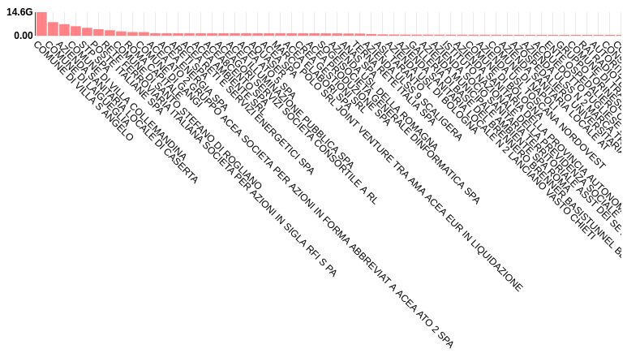

# Analisi dei competitor ANAC

## Introduzione
Questo post racconta la seconda parte dell'analisi condotta utilizzando il [dataset](https://dati.anticorruzione.it/#/home) messo a disposizione dall'**ANAC**, l'*Autorità Nazionale Anti-Corruzione*.

Una prima analisi su tutto il dataset, di tipo esplorativo, è stata presentata [**qui**](https://dataportal.daf.teamdigitale.it/#/private/userstory/list/8124c5ce-74a9-4425-9186-00f122e6c0a9).

In questa seconda parte affronteremo l'analisi dei **competitor diretti**, ovvero delle aziende concorrenti all'interno dello stesso bando di gara. In particolare le aziende possono concorrere singolarmente ad ogni bando, nel qual caso li indichiamo come **Partecipanti Multipli** oppure possono partecipare in gruppo, formando un **Raggruppamento**.

L'intera analisi tecnica è liberamente disponibile sotto forma di notebook [qui](https://github.com/fabiana001/anacAnalysis/)

## Raggruppamento

La formazione di un **raggruppamento** è disciplinata dall'[*art.48*](https://www.codiceappalti.it/dlgs_50_2016/art__48__raggruppamenti_temporanei_e_consorzi_ordinari_di_operatori_economici/8422) del *codice degli appalti*. Per meglio comprendere questa analisi, è opportuno riportare i criteri principali che devono seguire gli operatori economici che intendono formare un raggruppamento.

Il raggruppamento dovrebbe essere una formazione temporanea, legata alla gara in questione, e può essere di tipo **orizzontale** se le aziende che compongono il gruppo sono finalizzate a realizzare i lavori della stessa categoria oppure di tipo **verticale** se le aziende che compongono il gruppo operano in ambiti diversi e una di queste realizza i lavori della categoria prevalente.

Inoltre, ai fini della costituzione del raggruppamento temporaneo, gli operatori economici devono conferire, con un unico atto, mandato collettivo speciale con rappresentanza ad uno di essi, detto **mandatario**.

Nel caso di forniture o servizi, per raggruppamento di tipo verticale si intende un raggruppamento di operatori economici in cui il **mandatario** esegue le prestazioni di servizi o di forniture indicati come principali anche in termini economici, i **mandanti** quelle indicate come secondarie; per raggruppamento orizzontale quello in cui gli operatori economici eseguono il medesimo tipo di prestazione; le stazioni appaltanti indicano nel bando di gara la prestazione principale e quelle secondarie.

Inoltre, è fatto divieto ai concorrenti di partecipare alla gara in più di un raggruppamento temporaneo o consorzio ordinario di concorrenti, ovvero di partecipare alla gara anche in forma individuale qualora abbiano partecipato alla gara medesima in raggruppamento o consorzio ordinario di concorrenti. È vietata l'associazione in partecipazione sia durante la procedura di gara sia successivamente all'aggiudicazione.

## Analisi esplorativa
In questa sezione di analisi preliminare, a partire dal dataset dell'*ANAC*, filtrato relativamente ai bandi nell'anno 2017 e incrociato con il dataset di *indicePA* per migliorare la consistenza dei dati, vengono generati due nuovi dataset: 

- il dataset dei **Partecipanti Multipli**, che contiene tutte le informazioni relative solamente ai bandi di gara in cui partecipa più di un'azienda
- il dataset dei **Raggruppamenti**, che si compone di tutti i bandi in cui partecipano le aziende in forma di raggruppamento.

È importante notare che i due dataset non sono disgiunti, ma condividono un migliaio di elementi in comune (i.e. bandi e contratti in cui partecipano più aziende in forma di raggruppamento o come singoli).

Osserviamo che il dataset *Partecipanti Multipli* contiene **147640** bandi distinti, mentre il dataset *Raggruppamenti* ne contiene **4702**, entrambi ovviamente con le *27 feature* (proprietà, metadati relativi al bando), che erano presenti nel dataset originale.

Come prima visualizzazione, i bandi vengono divisi in un istogramma in contenitori diversi, a seconda dell'importo aggiudicato:

Il colore blu scuro, non presente in legenda, rappresenta la sovrapposizione dei due colori relativi ai dataset, indaco e verde.

Notiamo subito che la maggior parte dei bandi è ospitata dalla categoria che comprende un valore di assegnazione compreso fra i *1.000* e i *40.000*€. Il motivo principale che ci ha indotto a scegliere questa soglia è che *40.000*€ è il limite massimo di una gara indetta da una pubblica amministrazione e assegnata tramite affidamento diretto, come deliberato dall'[**art.36**](https://www.codiceappalti.it/dlgs_50_2016/art__36__contratti_sotto_soglia/8406) del *codice degli appalti*.

Inoltre, osserviamo che dalla fascia dei *1.000€* in su i raggruppamenti sono molto più frequenti rispetto alle categorie inferiori, che sono invece più numerosamente popolate da **partecipanti singoli** in competizione fra loro.

Approfondiamo ulteriormente la modalità di svolgimento del bando andando a sezionare i dataset a seconda della tipologia di affidamento risultante dall'assegnazione:

In questo primo grafico, la lunghezza della barra è data dal numero dei bandi in una determinata categoria. Osserviamo una preoccupante prevalenza di bandi in **affidamento diretto**, in **cottimo fiduciario** o assegnati con una **procedura senza bando** a scapito invece di una "*procedura aperta*" che assicura una vera gara fra i competitor, ma che complessivamente ammonta a meno di un terzo dei bandi.

Ma noi sappiamo che gli affidamenti diretti non possono oltrepassare la soglia dei *40.000€*, e provvediamo quindi a riscalare questo grafico a seconda degli importi assegnati, ottenendo:

Questo quadro, che rappresenta sempre le categorie di assegnazione ma stavolta con il numero dei bandi pesato a seconda dell'ammontare in denaro, è decisamente più confortante. Oltre il **50%** dell'importo viene assegnato tramite una **procedura aperta** e circa l'**11%** con una **procedura ristretta**; gli importi tramite **procedura negoziata senza bando **risultano essere circa il **15%**, mentre l'**affidamento diretto**, fra **cottimo **e **quadroconvenzione** ammonta a circa il **20%** del totale dei capitali.

Un altra feature che possiamo utilizzare per visualizzare i bandi dei nostri dataset è la data di aggiudicazione. Presentiamo due grafici a barre in cui i bandi vengono divisi a seconda del **mese di aggiudicazione**; il primo è un semplice **conteggio** numerico, il secondo riscala questa cifra prendendo in considerazione l'**importo **dei bandi, come abbiamo fatto nel paragrafo precedente.

Nel primo grafico osserviamo un calo del numero di bandi nel mese di Agosto, come ci saremmo aspettati data la minore attività delle pubbliche amministrazioni in questo mese. Durante gli altri mesi il numero di bandi è pressoché costante.

Nel secondo grafico, vediamo che la spesa più ingente avviene nel mese di Gennaio. Il dataset da noi utilizzato contiene anche i contratti di fornitura di servizi, che sono spesso si durata annuale e partono quindi proprio da questo mese.

Oltre a fare un'analisi dei metadati temporali, possiamo utilizzare i metadati geografici, ad esempio dividendo i dataset a seconda delle **Regioni** di appartenenza delle pubbliche amministrazioni che hanno indetto i bandi di gara. 

Di seguito viene visualizzato il numero di bandi per provincia prima come cifra, poi tenendo conto dell'importo del bando:

In entrambi i casi la Regione capolista risulta essere il **Lazio**, sia per numero di bandi che per importo aggiudicato. Infatti, preso singolarmente, il *Lazio *assegna quasi il *40% *del denaro totale dei bandi analizzati. In confronto la *Lombardia *, seconda classificata, non arriva neanche al *15%*, mentre tutte le altre Regioni sono sotto il *10%*. Da notare che da un grafico all'altro il trend è lo stesso, me nel grafico dell'importo le differenze sono decisamente più marcate, segno che quei (relativamente pochi) bandi in più del Lazio sono in realtà particolarmente costosi.

Questa stessa analisi può essere ripetuta su base provinciale. Ma non potendo visualizzare tutte e *110 *le province in un grafico, ci restringiamo a un sottoinsieme di *20* province. Nei due grafici che seguono abbiamo quindi il numero di bandi e l'importo di questi divisi fra delle province di esempio. 

La percentuale indicata nei grafici non è presa sul totale dei bandi ma è presa solo su questo specifico sottoinsieme di province.

Con questi grafici abbiamo terminato l'esplorazione di questi dataset. Avendo a disposizione **27 feature **ci sono molte domande a cui si può rispondere se si vuole approfondire qualcosa di specifico. Se si sta compiendo un'indagine su una particolare provincia, potrebbe essere utile una visualizzazione per *Comune*, oppure se ci sono delle discrepanze nel bilancio si possono mostrare le differenze fra le *somme aggiudicate *e quelle *liquidate*. Questa parte intendeva mostrare come, con relativa semplicità, si possano estrarre informazioni generali e interessanti dai nostri dataset.

Nella prossima sezione adottiamo un approccio diverso, meno generale ma più strumentale rispetto ad un'attività di indagine o sorveglianza. Ci concentriamo su dei bandi in particolare, in cui compaiono frequentemente gli stessi operatori commerciali in competizione fra loro, e utilizziamo un algoritmo di *Machine Learning* per far emergere eventuali bandi sospetti, che può essere un elemento utile ad accertare eventuali irregolarità.

## Generazione dataset di itemset

Per poter identificare più correttamente i bandi che contengono frequentemente gli stessi competitor, generiamo un nuovo dataset, il **dataset degli itemset **, composto da coppie di valori del tipo ***(Seq.Id, Itemset)***, dove *Seq.Id* identifica univocamente un bando tramite il proprio *cig* (*codice identificativo gara*) e *Itemset* rappresenta la lista dei *codici fiscali *di tutti i competitor, gli operatori commerciali che partecipano al bando.

Nel [notebook](https://github.com/fabiana001/anacAnalysis/) viene mostrato dettagliatamente come poter filtrare tutti i bandi caratterizzati da partecipanti sotto forma di raggruppamento e/o più aziende concorrenti e come fare per generare l'itemset corrispondente ad ogni bando.

Per capire meglio prendiamo ad esempio il bando con cig *6911006690*. Il bando è caratterizzato da due partecipanti: i) *Karon s.r.l (p.iva 02092110036)*; ii) *Agenzia delle Entrate contabilità speciale (p.iva 06363391001)*. Il dataset degli itemset conterrà la coppia *(Seq.Id, Itemset)*, dove:

- Seq.Id = 6911006690;
- Itemset = 02092110036 06363391001.

Una volta svolta questa operazione per tutti i bandi a nostra disposizione, il dataset così generato verrà dato in input ad un algoritmo di **Frequent Pattern Mining** chiamato **[FP-Growth](https://wimleers.com/sites/wimleers.com/files/FP-Growth%20presentation%20handouts%20%E2%80%94%C2%A0Florian%20Verhein.pdf)**. Questo algoritmo è studiato per trovare i pattern frequenti, ovvero nel nostro caso per identificare i bandi che hanno gli stessi competitor. *FP-Growth* funziona nel seguente modo:

- Nel primo passaggio, l'algoritmo conta l'occorrenza di elementi (coppie attributo-valore) nel dataset e li memorizza in una "tabella di intestazione".
- Nel secondo passaggio, costruisce l'albero *FP-tree *inserendo il pattern in una determinata posizione: gli elementi di ogni pattern devono essere ordinati in ordine decrescente rispetto alla loro frequenza nel dataset, in modo che l'albero possa essere elaborato rapidamente. Gli elementi in ogni pattern che non soddisfano la soglia minima di copertura vengono scartati. Se molti pattern condividono gli oggetti più frequenti, l'albero FP fornisce una versione compressa degli elementi vicino alla radice dell'albero.
- L'elaborazione ricorsiva di questa versione compressa del dataset principale aumenta direttamente l'efficenza con itemset grandi, invece di generare elementi candidati e testarli sull'intero database. La crescita inizia dal fondo della tabella di intestazione (nei rami più lunghi), trovando tutti i pattern che corrispondono alla condizione data. Viene creato un nuovo albero, con i conteggi proiettati dall'albero originale corrispondente all'insieme di pattern che sono condizionati da un attributo, con ogni nodo che contiene la somma dei conteggi dei nodi figli.
- La crescita ricorsiva termina quando nessun pattern individuale (condizionato da un'attributo) soddisfa la soglia minima di supporto e l'elaborazione continua sugli elementi di intestazione rimanenti dell'albero FP originale.
- Una volta completato il processo ricorsivo, sono stati trovati tutti gli insiemi di pattern di grandi dimensioni con copertura minima.

L'implementazione dell'algoritmo *FP-Growth *utilizzato per la scoperta degli itemset frequenti nel nostro esperimento può essere scaricato [qui](http://www.philippe-fournier-viger.com/spmf/index.php?link=download.php).

Nella sezione che segue svolgeremo un'analisi esplorativa partendo dalle sequenze estratte.

## Analisi esplorativa basata su itemset frequenti
Gli itemset frequenti estratti tramite *FP-Growth* possono essere utilizzati per effettuare analisi esplorative specifiche. Ad esempio, prendendo un particolare itemset frequente, si possono analizzare le distribuzioni di alcune feature numeriche e categoriche rispetto al dataset dei bandi in cui hanno partecipato insieme tutte le aziende presenti nella sequenza estratta (questo sottoinsieme è di seguito chiamato *subset*). Inoltre, le distribuzioni così estratte possono essere confrontate con quelle ottenute dal dataset dei bandi in cui non hanno partecipato contemporaneamente tutte le aziende presenti nell'itemset frequente scelto, ma solo alcune di queste (il dataset su questo sottoinsieme è chiamato di seguito *other*).

Ci sono due tipologie di analisi che possono essere svolte:

- **Analisi Univariata** - permetterà di vedere come si distribuiscono i dati rispetto alla feature in esame
- **Analisi Bivariata** - permetterà di scoprire correlazioni tra coppie di feature

Nel nostro esperimento, eseguiamo l'algoritmo assegnando un opportuno **supporto minimo**, non troppo basso per evitare di avere pochi elementi e non troppo alto per escludere eventuali sequenze poco frequenti. Otteniamo i seguenti valori statistici:

Vediamo che da ***169614 *aziende** analizzate sono state estratte ***60* sequenze frequenti**, che appartengono al dataset *itemset*. Queste sequenze sono però ridondanti e corrispondono in realtà soltanto a ***9* aziende** che concorrono spesso insieme. Il **supporto medio** è calcolato a partire dal singolo supporto di ogni sequenza frequente, ovvero secondo il numero di bandi in cui le aziende hanno partecipato assieme, e viene mediato su tutti i supporti presenti.
La **sequenza massimale** è la più lunga sequenza frequente presente, nel nostro caso pari a ***6 *aziende**. 

Per proseguire l'analisi esplorativa, prendiamo, a titolo dimostrativo, una sequenza frequente di aziende, rappresentata dai propri codici fiscali:

Il **supporto** rappresenta il numero di gare a cui questa frequenza ha preso parte e vediamo che è molto vicino alla cifra del supporto medio calcolata precedentemente. 
Utilizziamo i codici fiscali per identificare le aziende e associargli una denominazione. Quasi sempre vengono identificate correttamente, sebbene i risultati per i campi *denominazioneStrutturaProponente* e *denominazionePrimoaggiudicatario* siano spesso ridondanti (diverse denominazioni di aziende ma stesso codice fiscale) ma la qualità del dato potrebbe essere migliorata facendo un'aggregazione sui relativi codici fiscali per poi associare a quelli restituiti la denominazione dell'operatore commerciale relativo.

Inoltre abbiamo a disposizione tutti i **metadati**, per ogni bando, relativi ad ogni azienda che ha partecipato, come possiamo vedere esplorando la tabella seguente.

A partire da queste informazioni si possono compiere studi statistici sulle 28 feature disponibili (nell'img. ridotte a 6 per necessità di visualizzazione); ne utilizzeremo alcune delle più rilevanti nei paragrafi che seguono.

Come abbiamo accennato precedentemente ogni sequenza frequente potrebbe contenere al proprio interno una sottosequenza anch'essa frequente. Ad esempio delle *6 aziende* identificate come sequenza frequente, molte potrebbero continuare a partecipare a gruppi di 3 o 4 oppure singolarmente. Possiamo contare facilmente i bandi in cui queste aziende non hanno partecipato insieme:

Da questo semplice conteggio osserviamo che le aziende partecipano molto spesso assieme (come sequenza) e molto raremente come singoli. Questo non è automaticamente un campanello per un'irregolarità, potrebbero esserci molte altre spiegazioni, come la convenienza economica, la vicinanza geografica e il ristretto campo di interesse di un servizio o di una fornitura, ma è sicuramente un'informazione rilevante, che dovrebbe spingere ad approfondire. Indi per cui utilizziamo questo esempio come occasione per visualizzare delle statistiche interessanti e capire cos'altro possiamo sapere a partire da questi dati.

## Analisi univariata

Iniziamo a visualizzare la distribuzione delle strutture che hanno proposto i bandi relativamente al dataset **subset** (che, ricordiamo, raccoglie i bandi in cui hanno partecipato insieme tutte le aziende presenti nella sequenza estratta) e **other** (dataset dei bandi in cui hanno partecipato solo alcune delle aziende presenti nella sequenza). Osserviamo che i grafici a barre riflettono correttamente il conteggio effettuato precedentemente:

Cerchiamo adesso di capire con quale modalità sono state vinte queste gare. Avevamo già compiuto un'analisi utilizzando questa feature sul dataset generale, adesso ordiniamo in un grafico le varie tipologie di assegnazione dei fondi a seconda dei due nuovi dataset:

Da questo grafico emerge che la maggior parte dei bandi si sono conclusi tramite una **procedura negoziata**, nel caso del dataset *subset* oppure tramite una **procedura ristretta**, nel caso del dataset *other*. Queste tipologie sono una maggiore sicurezza di garanzia del corretto svolgimento della gara, al contrario invece di una modalità di **affidamento diretto** che potrebbe far sospettare la presenza di una qualche **irregolarità**.

Vediamo adesso quale operatore economico ha vinto più gare proposte da queste strutture, distinguendo le visualizzazioni in due grafici sempre relativamente ai due dataset:

Notiamo che le due distribuzioni sono piuttosto scarsamente correlate e che nel secondo grafico è presenta una barra relativa a "raggruppamento", che identifica le gare vinte da un raggruppamento in cui era presente almeno una delle aziende analizzate.

Fra i vari metadati che abbiamo a disposizione ci sono anche gli attributi temporali legati al mese di aggiudicazione del bando. Nel grafico che segue confrontiamo il trend temporale dei bandi fra i due dataset *subset *e *other *con l'andamento di tutto il dataset generale, per vedere se ci sono discrepanze rilevanti:

Osserviamo che l'andamento delle curve dei due dataset segue piuttosto fedelmente quello generale, tranne per il mese di agosto e settembre, in cui c'è una crescita delle assegnazioni anziché un calo. Il motivo è probabilmente da ricercarsi nel fatto che le aziende da noi analizzate operano nel campo della fornitura di petrolio e gas per le pubbliche amministrazioni, che utilizzano la materia prima probabilmente per fini di riscaldamento o di locomozione indi per cui i rifornimenti avvengono in maniera cadenzata, spesso annualmente alla riapertura delle strutture, oppure ogni 6 mesi.

Vediamo adesso di indagare la parte economica delle gare, svolendo un conteggio degli importi assegnati e liquidati nei due dataset:

Nel primo grafico vediamo che c'è un particolare addensamento nella regione compresa fra i *1.000€* e i *40.000€*, che prende più dell'*80%* dei bandi analizzati del dataset *subset*. Ricordo che la scelta di sezionare i capitali in queste fasce è stata presa seguendo le normative che regolano i bandi e, in particolare, sotto i *40.000€* è possibile effettuare un assegnamento diretto. Questo curioso affollamento in questa fascia di capitali potrebbe quindi risultare sospetto, ma abbiamo già svolto l'analisi per modalità di svolgimento e abbiamo rilevato che l'assegnamento diretto non era sicuramente fra le scelte più popolari, segno che effettivamente i bandi di gare che sono stati analizzati sono semplicemente di bassa entità di capitali.

Nel secondo grafico osserviamo invece che queste stesse aziende, quando non partecipano tutte insieme, prendono parte a gare con importi molto diversi. Vediamo che la maggior parte delle gare è concentrata nelle due fasce, fra *1.000€* e *40.000€* (circa *40%*) e fra *40.000€* e *1.000.000€* (circa 50%). Essendo questi operatori commerciali dei fornitori di idrocarburi, ci saremmo aspettati un giro di affari con un elevato tenore e d'altronde ci sono anche gare che superano *1 milione di €*.

Osserviamo anche che la differenza fra gli *importi assegnati *e quelli effettivamente *liquidati* è estremamente bassa e risulta notevole solamente per i bandi con somme inferiori a *100€*, che spesso vengono liquidate direttamente in contanti.

Come ultimo studio relativo all'analisi univariata andiamo a visualizzare la durata del bando in dettaglio usando un istogramma e in maniera aggregata tramite un boxplot:

La maggior parte dei bandi ha durata molto breve e diventa direttamente esecutiva. Ci sono alcuni bandi che sono ogni mese oppure ogni 3 mesi ma sono molto pochi. La differenza interessante fra i due grafici è il massimale che nel primo caso arriva a 6 mesi, mentre nel secondo copre diversi anni.

Proseguiamo adesso la nostra analisi provando a studiare determinate coppie di feature per vedere se risultano correlate, ovvero svolgiamo un'analisi bivariata. Come per la sezione precedente le analisi verranno confrontate con il dataset *subset *e il dataset *other*.

## Analisi Bivariata

