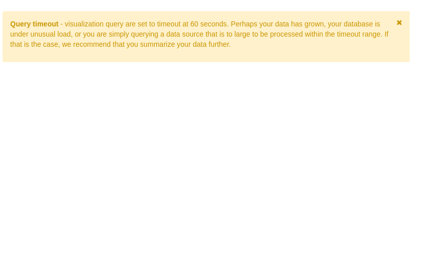

# Diritto allo Studio Universitario (Alloggi e Mense)

## Analisi dei dati del MIUR relativi al DSU del periodo 2014-2017

<h2 class="">Introduzione</h2>
<u> </u>Il <b><a href="http://www.dsu.miur.gov.it/">Diritto allo Studio Universitario</a></b> (<b>DSU</b>) sostiene le studentesse e gli studenti che vogliono frequentare l'Università, sulla base della <b>condizione economica </b>e di alcuni requisiti di <b>merito</b>. Il supporto fornito dal <i>DSU</i> consiste sia in servizi rivolti alla generalità degli studenti universitari, come la ristorazione, le attività di orientamento, la consulenza nella ricerca di un alloggio, le agevolazioni per eventi culturali o sportivi, sia intervenendo con benefici assegnati per concorso agli studenti meritevoli ma privi di mezzi economici, come le borse di studio, i posti letto presso le residenze universitarie e altri tipi di contributi economici (per mobilità internazionale, iniziative culturali ed editoriali, etc.).

La gestione di questi servizi avviene tramite aziende regionali (enti). I dati relativi al <i>DSU </i>sono raccolti dalle Regioni ed elaborati dall'<i>Ufficio Statistica e Studi</i> del <i>MIUR</i> a partire dall'a.a. <i>1997/1998</i> e sono rilasciati in formato di <b><a href="http://ustat.miur.it/opendata/">OpenData</a></b>. I dataset che andremo ad analizzare, relativi ai<i> 4</i> anni <i><b>2014-2017</b></i> di esercizio, sono stati importati e integrati all'interno del <a href="https://dataportal.daf.teamdigitale.it/"><i>DAF </i></a>e contengono informazioni che riguardano: 

* <b>Posti-alloggio</b> e <b>mense</b> relativi a ciascun ente, istituto universitario e Regione 

* <b>Interventi </b>concessi a studenti per ciascun Ateneo o Istituto gestito da ciascun ente per ogni Regione; 

* <b>Spesa </b>impegnata per interventi concessi a studenti per ciascun Ateneo o Istituto nell’esercizio finanziario (gestione di competenza)

* Dati relativi al <b>personale dipendente </b>di ogni ente.

Ulteriori informazioni e note aggiuntive sono disponibili sul<a href="http://ustat.miur.it"> sito</a> del <i>MIUR </i>nella <a href="http://ustat.miur.it/attivit%C3%A0/diritto-allo-studio/">sezione</a> dedicata al <i>DSU</i>.

In questa storia verranno analizzati i dati relativi alle residenze universitarie, ai posti-allogio, alle mense e al servizio di ristorazione. 

<h2>Alloggi e mense</h2><h3>Dashboard: <a href="https://bi.daf.teamdigitale.it/superset/dashboard/60/">Alloggi e Mense 2014-2017</a></h3>
Aprendo la <b>dashboard </b>su<i> Superset</i> possiamo visualizzare interattivamente i dati complessivi relativi ai posti-alloggio e alle mense relativi al periodo <i>2014-2017,</i> di seguito verranno discussi e commentati; i grafici rilevanti verranno inseriti in questa storia per seguirla più agevolmente.

Iniziamo l'analisi contando il numero totale dei posti-alloggio messi a disposizione per ogni anno nel periodo di interesse. Notiamo che i numeri relativi al <i>2015</i> sono decisamente fuori scala, probabilmente frutto di un errore di duplicazione da parte dell'<i>USS</i>, eviteremo di tenerne conto per questa analisi. Nel<i> 2017</i> il <b>numero di alloggi</b> è di <b><i>82770</i></b>, piuttosto stabile rispetto agli altri anni, <i>+3%</i> rispetto al <i>2014</i>, <i>-1%</i> rispetto al <i>2016</i>. 

Possiamo vedere quali Regioni hanno assegnato più alloggi, suddividendo i dati in un<i> istogramma</i> per Regione,  per il <i>2017</i> otteniamo:

Confrontando gli anni diversi tramite la dashboard osserviamo che in tutto il periodo <i>2014-2017</i> analizzato permane lo stesso ordinamento al vertice:<i> Lombardia, Toscana, Emilia-Romagna</i>. Le prime due hanno offerto anche <b>più allogi</b> nel<i> 2017</i> rispetto all'anno precedente, <b><i>+60 Lombardia, +24 Toscana</i></b>, al contrario di quasi tutte le altre Regioni, che invece hanno diminuito i posti disponibili, fra cui spicca il<i> -843</i> delle <i>Marche</i>).

Inserendo i dati in un diagramma <i>sunburst </i>possiamo interattivamente navigare ogni Regione e suddividere le assegnazioni fra i diversi Istituti e per tipologia di assegnazione. Per visualizzare il dato di interesse bisogna evidenziare la "<i>fetta di torta</i>" relativa con il cursore. 

Tramite questa visualizzazione  appare evidente che il successo della<b><i> Lombardia</i></b> avviene grazie agli innumerevoli Istituti presenti, ad esempio il solo<i> Politecnico di Milano</i> ha assegnato posti-alloggio in numero circa uguale a tutte le università della<i> Calabria</i>. Generalmente le Regioni hanno un unico <i>Ente</i> che gestisce più Istituti, come nel caso della<i><b> Toscana</b></i>, in cui l'<i>ARDSU</i> gestisce l'<i>Università di Pisa, Firenze </i>e <i>Siena</i> e non possiamo quindi sapere esattamente fra quali di queste Università sono ripartiti i posti-alloggio. 

Osserviamo inoltre che le tre Regioni principali contribuiscono insieme al <i><b>42% </b></i>dell'intera assegnazione e che il<i> Lazio</i>, che comprende l'Università più grande d'Europa per numero di iscritti (la<i> Sapienza</i>), si classifica dietro le<i> Marche</i>. Non viene evidenziato alcun cambiamento rilevante nel passaggio da un anno a un altro, gli istituti sembrano mantenere pressoché costanti i  numeri degli alloggi, senza investire particolarmente risorse.

 Al contrario dei posti-alloggio, il <b>numero di mense </b>è invece in tendenziale<b> crescita</b>, <b><i>+19%</i></b> globalmente in tutta Italia fra<i> 2014</i> e il <i>2017</i>, passando da<i> 222</i> a<i> 265</i>. Attenzione però, il numero di mense non sempre è indicativo del numero di posti-mensa o di pasti serviti, poiché non sono elementi uniformi fra loro, ma variano di mensa in mensa. Altri indicatori saranno analizzati di seguito che forniranno una stima più adeguata del servizio di ristorazione.  

Intanto, dividendo i dati del numero di mense per Regione, otteniamo per il<i> 2017</i>: 

<a class="add-widget-link">Add Widget</a>

<ul class="nav navbar-right panel_toolbox"><li><a class="close-link"><i class="fa fa-close"></i></a></li></ul>

Non c'è da stupirsi se la spinta maggiore viene ancora una volta dalla <b><i>Lombardia</i></b>, che contribuisce con le sue<i><b> 60</b></i> <b>mense</b> (<i>+24</i> rispetto al<i> 2014</i>) a far fronte alle richieste degli studenti. La <i><b>Toscana</b></i> invece, dopo aver investito negli anni passati, ha ridotto il numero nell'ultimo anno (<i>+3</i> mense rispetto al <i>2014</i> ma -<i>6</i> rispetto al<i> 2016</i>). Degno di nota il tracollo del <i><b>Friuli-Venezia Giulia</b> </i>che è passato da <i>24</i> mense nel <i>2014</i> ad averne solo <i>4</i> nel <i>2017.</i>

L'informazione utile derivante dall'analisi del numero di mense non è tanto la cifra in sé quanto più la tipologia, ovvero la <b>modalità di gestione </b>della mensa, sia essa<b> diretta</b> o<b> indiretta</b>. Possiamo visualizzare questo dato in un grafico a torta che prende in considerazione la totalità delle mense italiane nel <i>2017</i>: 

Da questo grafico a torta relativo al<i> 2017</i> osserviamo che solo il<i> <b>12.5%</b></i> delle mense (pari a<i> 33</i>) viene gestito in maniera <b>diretta</b> dall'<i>Ente</i>, mentre la gestione della maggioranza delle mense, l'<b><i>87.5%</i></b> (<i>232</i>) viene appaltato a un'<b>azienda esterna</b> o a un servizio di ristorazione convenzionato.

Nel grafico <i>sunburst</i>, sempre relativo al<i> 2017</i>, emerge un altro elemento interessante. Suddividendo la tipologia per Regione è possibile vedere quali sono le Regioni che esternalizzano maggiormente il servizio e quali invece tendono a gestirlo autonomamente. Si osserva che ci sono molte Regioni che appaltano interamente il servizio (<i>Puglia, Sicilia, Lazio, Emilia-Romagna, Umbria, </i>etc.) mentre sono relativamente poche quelle che gestiscono le mense anche direttamente, seppur con una media percentuale nettamente superiore a quella nazionale (<i>Lombardia 16.7%, Toscana 26.5%, Marche 42.9%, Veneto 27.3%, Sardegna 66.3%, Liguria 20%</i>). 

Consideriamo adesso il <b>numero di posti disponibili</b> all'interno delle mense, essendo questo è un miglior indicatore dell'entità del servizio di ristorazione fornito rispetto al semplice numero di mense. Secondo i dati del <i>MIUR </i>il numero totale di posti-mensa offerti nel <i>2017</i> ammontava a circa<b><i> 47200</i></b>, cifra tendenzialmente stabile rispetto agli anni precedenti. Ancora una volta, visualizziamo questo dato distinguendolo per ogni Regione: 

Possiamo vedere come questo grafico segua in maniera abbastanza fedele il grafico del numero di mense, con qualche piccola eccezione. Si conferma capolista la <b><i>Lombardia</i></b>, unica a sfondare le<i> 4</i> cifre di posti disponibili, tiene bene la<b><i> Toscana,</i></b> mentre sale notevolmente il<b><i> Veneto,</i></b> che nonostante possegga tutto sommato poche mense, <i>11,</i>  evidentemente queste sono di grandi dimensioni, poiché dovendo gestire <i>3414</i> studenti,  in media ogni mensa ne ospita <i>310</i>.
Confrontando il dato con gli anni precedenti possiamo  confermare che il crollo del<b><i> Friuli-Venezia Giulia</i></b> nel numero delle mense non è avvenuto per un accorpamento fra queste, ma a causa di una  chiusura delle mense, poiché il dato nel numero di mense si riflette nettamente nella drastica riduzione del numero di posti-mensa, dai <i>5731</i> del <i>2014</i> ai<i> 1238</i> del <i>2017,</i> ovvero <b><i>-78%.</i></b> 
Per quanto riguarda le altre Regioni vediamo che il numero dei posti è aumentato notevolmente per le principali (<i>Lombardia, Toscana, Veneto, Marche, Lazio</i>) mentre è rimasto pressoché costante o leggermente diminuito per quelle che già offrivano pochi posti-mensa (<i>Piemonta, Liguria, Abruzzo</i> etc.).

Adesso che abbiamo un quadro abbastanza completo del servizio fornito, introdurre gli studenti come ulteriore variabile. A fronte di queste infrastrutture quanti sono gli studenti che usufruiscono del servizio? Per il<i> 2017</i>, siamo intorno ai<i> <b>325000</b></i> studenti diversi, cifra piuttosto stabile rispetto agli anni precedenti (<i>2015</i> compreso). Ma andiamo a vedere con un istogramma quali sono le Regioni che erogano pasti al maggior numero di studenti distinti: 

Vediamo che è la<i><b> Toscana</b></i> la Regione che serve il maggior numero di studenti, a scapito della <b><i>Lombardia</i></b> che, pur possedendo molti più posti, non riesce a sfruttarli pienamente. Le altre Regioni seguono tendenzialmente il trend dei posti mensa messi a disposizione, segno che effettivamente quando il servizio viene promosso, gli studenti sono invogliati a usufruirne. Notiamo che il dato dell'<i><b>Emilia-Romagna </b></i>non è pervenuto e questa mancanza viene indicata con un <i>-2 </i>nel grafico. &nbsp;   
Lo stesso trend su base regionale si conferma anche per quanto riguarda l'<b>erogazione dei pasti</b>, seguendo un andamento direttamente proporzionale al numero di posti-mensa disponibili. Il numero totale di pasti per gli anni considerati si assesta intorno ai <b><i>20 milioni</i></b> senza sostanziali fluttuazioni. Si può osservare sulla dashboard che l'<i>Emilia-Romagna</i> contribuisce notevolmente all'offerta di ristorazione, arrivando terza (<i>11.3%</i>), subito dopo <i>Toscana </i>(<i>20.7%</i>) e<i> Lombardia</i> (<i>14%</i>), dato che ci era sfuggito in precedenza.

Grazie al dataset dei pasti erogati possiamo confermare e migliorare il dato ottenuto in precedenza relativo alla<b> tipologia di gestione</b> della mensa (<b>diretta</b>, <b>indiretta</b>,<b> ristorazione convenzionata</b>). Suddividiamo i pasti erogati su base regionale in base al tipo di gestione tramite un grafico <i>sunburst</i>: 

La<i> Toscana</i> è effettivamente la Regione che crede maggiormente nella gestione diretta (<i>11.3%</i> del totale), mentre come avevamo potuto constatare dall'elaborazione del dataset svolta precedentemente sono molte le Regioni che non gestiscono direttamente le mense, i dati della vendita dei pasti sono assolutamente in linea con quelli delle mense.
<h2 class="">Conclusioni</h2>
 Concludiamo questa prima parte di analisi con una considerazione geografica, essendosi questa analisi sviluppata su base regionale. Osserviamo che le Regioni del <b>centro-nord</b> sono notevolmente più impegnate nell'offerta dei servizi, sia di alloggio sia di ristorazione. Le regioni particolarmente virtuose, come la <i>Lombardia </i>e la<i> Toscana</i>, si distinguono nella modalità di messa in opera dei servizi. Mentre la<i> Lombardia</i> può contare su un cospicuo numero di Istituti, che richiedono un adeguato apporto di servizi, e ogni <i>Ente</i> universitario gestisce i propri autonomamente, la <i>Toscana </i>ha invece scelto di accorpare la gestione delle tre Università in un solo<i> Ente</i>, il quale gestisce direttamente la maggior parte del servizio di ristorazione e delle residenze. Gli Istituti delle Regioni del <b>Sud Italia</b>, vuoi per piccola entità delle Università o per la mancanza di fondi, non offrono la stessa quantità di servizi, soprattutto per quanto riguarda i posti-alloggio, sono particolarmente carenti.
 

