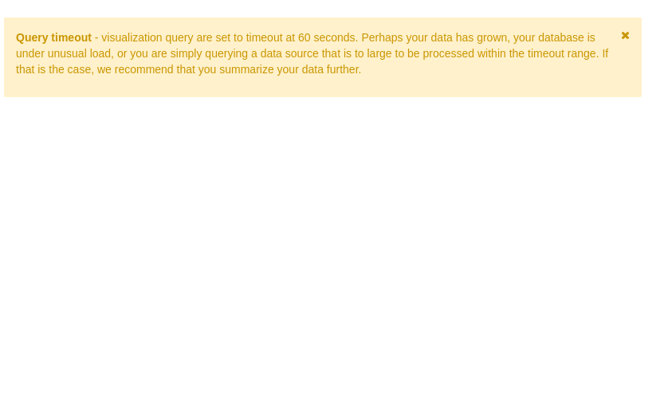

#Diritto allo Studio Universitario (Spese, Interventi e Dipendenti)

## Analisi dei dati del MIUR relativi al DSU del periodo 2014-2017

<i class="fa fa-close"></i></a></li></ul>

<h2>Introduzione</h2>
Il <a href="http://dsu.miur.gov.it/"><b>Diritto allo Studio Universitario</b></a> (<b>DSU</b>) sostiene le studentesse e gli studenti che vogliono frequentare l'Università, sulla base della <b>condizione economica </b>e di alcuni requisiti di <b>merito</b>. Il supporto fornito dal<i> DSU</i> consiste sia in servizi rivolti alla generalità degli studenti universitari, come la ristorazione, le attività di orientamento, la consulenza nella ricerca di un alloggio, le agevolazioni per eventi culturali o sportivi, sia intervenendo con benefici assegnati per concorso agli studenti meritevoli ma privi di mezzi economici, come le borse di studio, i posti letto presso le residenze universitarie e altri tipi di contributi economici (per mobilità internazionale, iniziative culturali ed editoriali, etc.).

La gestione di questi servizi avviene tramite aziende regionali (enti). I dati relativi al DSU sono raccolti dalle Regioni ed elaborati dall'<i>Ufficio Statistica e Studi </i>del<i> MIUR</i> a partire dall'a.a.<i> 1997/1998</i> e sono rilasciati in formato di<a href="http://ustat.miur.it/opendata/"><b> OpenData</b></a>. I dataset che andremo ad analizzare, relativi ai<i> 4</i> anni <b><i>2014-2017</i></b> di esercizio, sono stati importati e integrati all'interno del<a href="https://dataportal.daf.teamdigitale.it/"><i> DAF</i></a> e contengono informazioni che riguardano:

<b>* Posti-alloggio</b> e<b> mense</b> relativi a ciascun ente, istituto universitario e Regione

<b>* Interventi</b> concessi a studenti per ciascun Ateneo o Istituto gestito da ciascun ente per ogni Regione;

<b>* Spesa </b>impegnata per interventi concessi a studenti per ciascun Ateneo o Istituto nell’esercizio finanziario (gestione di competenza)

* Dati relativi al<b> personale dipendente</b> di ogni ente.

Ulteriori informazioni e note aggiuntive sono disponibili sul <a href="ustat.miur.it">sito</a> del <i>MIUR </i>nella <a href="http://ustat.miur.it/attivit%C3%A0/diritto-allo-studio/">sezione</a> dedicata al <i>DSU</i>.

In questa storia verranno analizzate le spese e gli&nbsp; interventi di sostegno per le lauree e i dottorati, e i dati relativi ai dipendenti degli <i>Enti </i>a tempo determinato e indeterminato.

<h2>Spese e Interventi</h2><h3>Dashboard: <a href="https://bi.daf.teamdigitale.it/superset/dashboard/65/">Spese e Interventi 2014-2017</a></h3>
La <b>dashboard </b>su<i> Superset </i>offre le visualizzazioni complete e interattive dall'analisi dati che è stata condotta, relativa alle spese e agli interventi di sostegno nel periodo <i>2014-2017</i>. I grafici rilevanti saranno inseriti anche di seguito, dove verranno discussi e commentati.

Notiamo subito che il <b>numero totale di interventi </b>per le lauree è in aumento, passando da <i>760600</i> nel<i> 2014</i> a <i>978200</i> nel <i>2017</i>, un incremento del <i><b>28.6%</b></i>. Per saperne di più suddividiamo questo numero fra le diverse Regioni, per il <i>2017</i> otteniamo: 

In tutto il periodo analizzato la Lombardia è sempre stata la Regione con il maggior numero di interventi, passando da 82290 nel 2014 a 120700 nel 2017, ovvero +46%. Seguono l'Emilia-Romagna (+45%), il Lazio (+37%) e la Toscana (+27%). Le Regioni che hanno perso posizioni è spesso perché non sono cresciute abbastanza rispetto alle altre. Osserviamo inoltre che c'è una discesa piuttosto graduale nella distribuzione, le Regioni non sono particolarmente distanti l'una dall'altra.  Buon posizionamento per le Regioni del Sud Italia che superano diverse Regioni del Nord, ma bisogna ricordare che il numero di interventi non è un buon indicatore della spesa sostenuta, che sarà probabilmente una stima migliore dell'impegno sostenuto dal DSU. 

Questo dataset offre anche una suddivisione per Istituto, che possiamo visualizzare tramite un grafico sunburst. Vediamo quali Atenei hanno assegnato più contributi per le lauree nel 2017: 
 

Vediamo che la Lombardia conquista il primato regionale in quanto gestisce un numero cospicuo di Atenei, mentre se consideriamo soltanto questi ultimi a spiccare è l'Università di Bologna, che con i suoi 59100 contributi di laurea (+42% dal 2014), traina l'Emilia-Romagna al secondo posto. A seguire abbiamo la Sapienza con 45800 contributi (+44%) e l'Università di Bari con 34100 che ha invece decrementato il numero di contributi (-23%). Non ci soffermeremo ulteriormente ad analizzare il numero di contributi erogati, essendo interessati maggiormente all'entità del costo del servizio fornito.  

Nel 2017 sono stati spesi complessivamente 559 milioni di euro, +21% rispetto al 2014, +10% rispetto al 2016. Analizziamo quindi la spesa sostenuta per interventi di Laurea suddividendola per Regione: 

